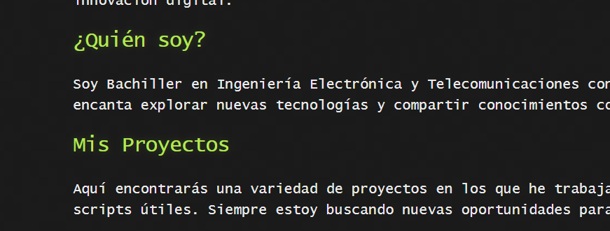

# Sobre Mí

¡Hola mundo! Soy Victor Rojas Aka. Gr3en, un apasionado de la ciberseguridad. Este blog es un espacio donde comparto mis pensamientos, proyectos y aprendizajes en el mundo de la programación y la innovación digital.

## ¿Quién soy?

Soy Bachiller en Ingeniería Electrónica y Telecomunicaciones con experiencia en ciberseguridad. Me encanta explorar nuevas tecnologías y compartir conocimientos con la comunidad.

## Mis Proyectos

Aquí encontrarás una variedad de proyectos en los que he trabajado, desde aplicaciones web hasta scripts útiles. Siempre estoy buscando nuevas oportunidades para aprender y crecer.

## Encuéntrame en las redes sociales

- [LinkedIn](https://www.linkedin.com/in/victor-rojas-damasco) - Conéctate conmigo y hablemos sobre oportunidades profesionales.
- [GitHub](https://github.com/tu-usuario) - Explora mis repositorios y contribuciones en proyectos de código abierto.
- [YouTube](https://www.youtube.com/c/tu-canal) - Únete a mi canal donde comparto tutoriales y contenido relacionado con la tecnología.

## Contacto

Si deseas ponerte en contacto conmigo, no dudes en enviarme un correo a [tuemail@example.com](mailto:tuemail@example.com).

---

¡Gracias por visitar mi blog! Espero que encuentres útil la información que comparto aquí.
